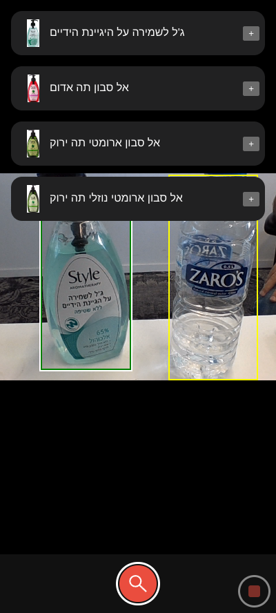

# Online Grocery Application - Vector Similarity Demo

An application that uses [vector similarity search](https://redis.io/docs/stack/search/reference/vectors/) in Redis for finding similar grocery items based on an image, and allows adding them to user's cart.



## How to run
To run the demo app (including redis server, [app](#basic-app) and [app_redisai](#advanced---orchestrate-flow-with-redisai-and-redisgears) containers) and load the data, run the following commands:
```bash
# Clone the repository
git clone https://github.com/RedisAI/VecSimGroceryDemo.git
cd VecSimGroceryDemo

# Launch the demo with docker-compose (may require sudo in linux)
docker compose up
```
The initialization may take a few minutes, so now is a good time to make yourself a coffee....

You can also run only one of the apps using
```bash
docker compose -f app.yml up
```
for running [app](#basic-app), and
```bash
docker compose -f redisai.yml up
```
for running [app_redisai](#advanced---orchestrate-flow-with-redisai-and-redisgears).

## Usage

Upon lunching the demo, a Redis instance is created in a container with grocery items data loaded into it. Each product is represented by a JSON document that was preloaded using [RedisJSON](https://redis.io/docs/stack/json), and contains the following properties: id, brand, name, family, and **a list of vector embeddings that represent images of the product** from different angels. These documents were indexed using [RediSearch](https://redis.io/docs/stack/search).

**Be aware:** the dataset contains ~30K products and overall almost 800K vectors (of size 512 floats), which require memory consumption of up to 15GB. Make sure that you run the demo on a machine with sufficient resources (otherwise the OS will kill Redis process).

### The flow
Upon sending a `search` request to the app server (by clicking on the camera button), the following steps take place:
1. An image detection model (yolov5) will run and mark all the items that were recognized in the image.
2. For every detected product:
   1. An encoding model (the output of the second last layer of resnet-18) will generate a vector embedding of the product image (note that this is the same model that generated the vector embeddings for the stored products images).
   2. Search for the top 4 similar products using *RediSearch*, and return them to the user.

### Basic app
For searching similar products, go to `localhost:5000` in your browser, and take a picture of the desired products. Then, the application will detect the products in the image and will search for the 4 most similar products that are available in the database. Every detected product will be marked with a rectangle whose color is either red, yellow or green, where red indicates relatively "low" similarity between the detected product and the similar products that were found, yellow indicates a solid match, and a green rectangle indicates that a good match was found with "high" similarity. The similar products should appear upon clicking the appropriate rectangle, while clicking the "+" sign will allow you to add the product to your (imaginary) cart.

### Advanced - orchestrate flow with RedisAI and RedisGears
You can run an "improved" application that runs the entire flow within Redis, by using `localhost:5001` (user experience should be exactly the same). While the basic app is responsible for running the entire flow within the app, the advanced app is leaner and only responsible for triggering the flow over the input image in [RedisGears](https://oss.redis.com/redisgears/index.html). Hence, the entire flow is being executed with a **single Redis command**, that in turn, uses [RedisAI](https://oss.redis.com/redisai/) module to run the models' inferences, and RediSearch module to perform the similar products search.

Note that with the advanced application, you can replace the underline detection and encoding models without changing the app itself! By updating `data/models_loader.py` and `app_redisai/gear.py` to use your new models, you can run `data/models_loader.py` while the demo is running and update the models stored in RedisAI. This will work, as long as you don't change the gear's entrypoint (currently `RunSearchFlow` is registered with 4 predefined inputs - see `app_redisai/app.py`).

Moreover, you can create locally a sample from the dataset by running `python3 items_loader.py` script from `/data` directory. This should load ~6300 items with around 38000 vectors embeddings from `/data/items` directory into the local running Redis instance. You can use this script to override your existing vector embeddings, in case of changing the underline encoding model (will require putting the items' JSON files and images in the `/data/items` directory).

### *Enjoy your shopping!*
